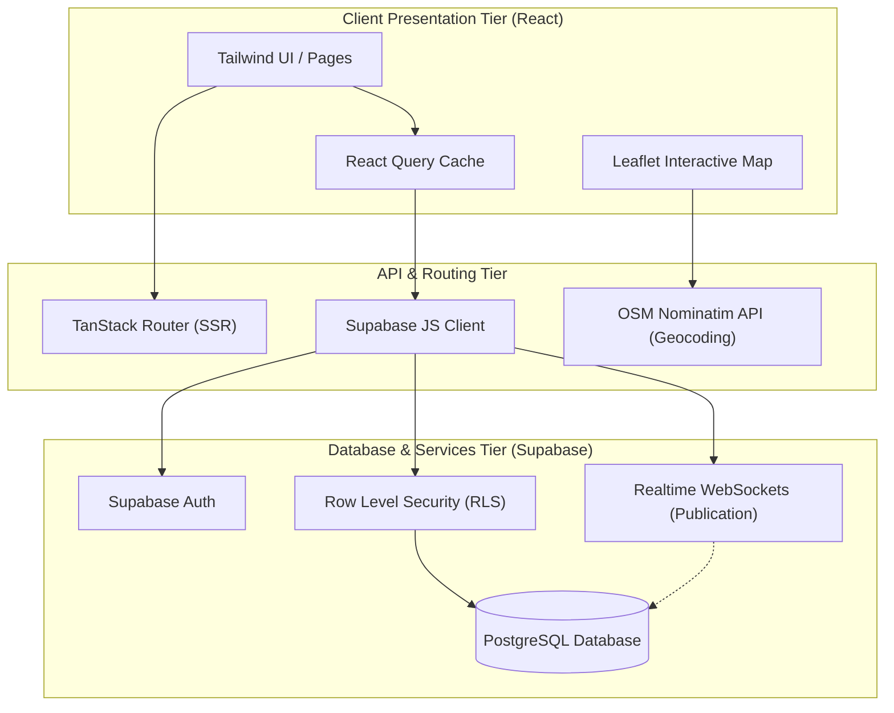
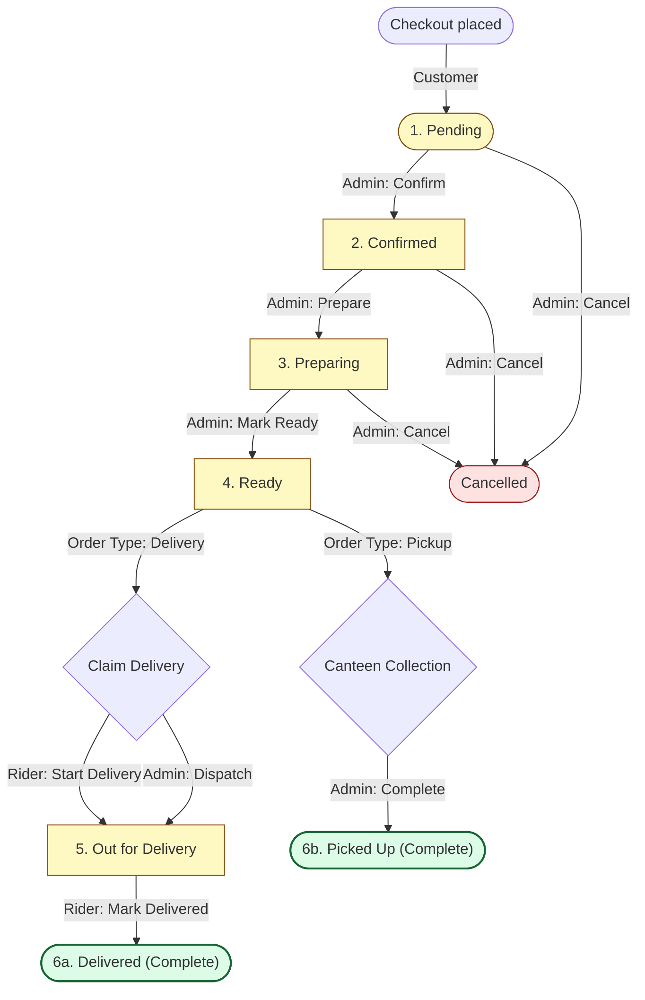

# FreshDrop System Architecture

This document describes the system tiers, data flows, order lifecycles, and security design of the FreshDrop Juice Order System.

---

## 🗺️ System Tier Architecture

The system uses a modern serverless three-tier architecture:
1. **Presentation Layer (Client)**: A React application running in the browser, built with TanStack Start (supporting Server-Side Rendering) and Styled with Tailwind CSS. It communicates with Leaflet for maps and OpenStreetMap Nominatim for geocoding.
2. **API & Realtime Client**: The Supabase JavaScript client, which manages queries over HTTPS REST API and handles real-time subscriptions over WebSockets.
3. **Data & Security Layer (Backend)**: Supabase Backend Services containing PostgreSQL database, Auth/user management, and Row Level Security policies.

![System Architecture Diagram](https://mermaid.ink/img/eyJjb2RlIjoiZmxvd2NoYXJ0IFREXG4gICAgJSUgUHJlc2VudGF0aW9uIFRpZXJcbiAgICBzdWJncmFwaCBDbGllbnQgW1wiQ2xpZW50IFByZXNlbnRhdGlvbiBUaWVyIChSZWFjdClcIl1cbiAgICAgICAgVUlbXCJUYWlsd2luZCBVSSAvIFBhZ2VzXCJdXG4gICAgICAgIFJRW1wiUmVhY3QgUXVlcnkgQ2FjaGVcIl1cbiAgICAgICAgTEZbXCJMZWFmbGV0IEludGVyYWN0aXZlIE1hcFwiXVxuICAgIGVuZFxuXG4gICAgJSUgTmV0d29yayAmIEFQSSBUaWVyXG4gICAgc3ViZ3JhcGggQVBJIFtcIkFQSSAmIFJvdXRpbmcgVGllclwiXVxuICAgICAgICBUU1JbXCJUYW5TdGFjayBSb3V0ZXIgKFNTUilcIl1cbiAgICAgICAgU0JDW1wiU3VwYWJhc2UgSlMgQ2xpZW50XCJdXG4gICAgICAgIE5PTVtcIk9TTSBOb21pbmF0aW0gQVBJIChHZW9jb2RpbmcpXCJdXG4gICAgZW5kXG5cbiAgICAlJSBCYWNrZW5kIFRpZXJcbiAgICBzdWJncmFwaCBCYWNrZW5kIFtcIkRhdGFiYXNlICYgU2VydmljZXMgVGllciAoU3VwYWJhc2UpXCJdXG4gICAgICAgIFNCQVtcIlN1cGFiYXNlIEF1dGhcIl1cbiAgICAgICAgU0JSW1wiUmVhbHRpbWUgV2ViU29ja2V0cyAoUHVibGljYXRpb24pXCJdXG4gICAgICAgIERCWyhcIlBvc3RncmVTUUwgRGF0YWJhc2VcIildXG4gICAgICAgIFJMU1tcIlJvdyBMZXZlbCBTZWN1cml0eSAoUkxTKVwiXVxuICAgIGVuZFxuXG4gICAgJSUgQ29ubmVjdG9yc1xuICAgIFVJIC0tPiBUU1JcbiAgICBVSSAtLT4gUlFcbiAgICBMRiAtLT4gTk9NXG4gICAgUlEgLS0+IFNCQ1xuICAgIFNCQyAtLT4gU0JBXG4gICAgU0JDIC0tPiBTQlJcbiAgICBTQkMgLS0+IFJMU1xuICAgIFJMUyAtLT4gREJcbiAgICBTQlIgLS4tPiBEQiIsIm1lcm1haWQiOnsidGhlbWUiOiJkZWZhdWx0In19)

Edit Diagram Source Code

---

## 🔄 Order Status Lifecycle Flowchart

The lifecycle of a juice order transitions through distinct preparation and delivery states. The flowchart below maps the states and labels the role (Customer, Admin, Rider) responsible for executing each transition:

![Order Status Lifecycle Flowchart](https://mermaid.ink/img/eyJjb2RlIjoiZmxvd2NoYXJ0IFREXG4gICAgJSUgTm9kZXNcbiAgICBQKFtcIjEuIFBlbmRpbmdcIl0pXG4gICAgQ1tcIjIuIENvbmZpcm1lZFwiXVxuICAgIFBSW1wiMy4gUHJlcGFyaW5nXCJdXG4gICAgUltcIjQuIFJlYWR5XCJdXG4gICAgT0ZEW1wiNS4gT3V0IGZvciBEZWxpdmVyeVwiXVxuICAgIEQoW1wiNmEuIERlbGl2ZXJlZCAoQ29tcGxldGUpXCJdKVxuICAgIFBVKFtcIjZiLiBQaWNrZWQgVXAgKENvbXBsZXRlKVwiXSlcbiAgICBDQU4oW1wiQ2FuY2VsbGVkXCJdKVxuXG4gICAgJSUgVHJhbnNpdGlvbnMgJiBSb2xlc1xuICAgIFN0YXJ0KFtDaGVja291dCBwbGFjZWRdKSAtLT4gfEN1c3RvbWVyfCBQXG4gICAgUCAtLT4gfEFkbWluOiBDb25maXJtfCBDXG4gICAgUCAtLT4gfEFkbWluOiBDYW5jZWx8IENBTlxuICAgIEMgLS0+IHxBZG1pbjogUHJlcGFyZXwgUFJcbiAgICBDIC0tPiB8QWRtaW46IENhbmNlbHwgQ0FOXG4gICAgUFIgLS0+IHxBZG1pbjogTWFyayBSZWFkeXwgUlxuICAgIFBSIC0tPiB8QWRtaW46IENhbmNlbHwgQ0FOXG4gICAgXG4gICAgJSUgT3JkZXIgVHlwZSBTcGxpdFxuICAgIFIgLS0+IHxcIk9yZGVyIFR5cGU6IERlbGl2ZXJ5XCJ8IE9GRF9UcmlnZ2Vye1wiQ2xhaW0gRGVsaXZlcnlcIn1cbiAgICBSIC0tPiB8XCJPcmRlciBUeXBlOiBQaWNrdXBcInwgUFVfVHJpZ2dlcntcIkNhbnRlZW4gQ29sbGVjdGlvblwifVxuICAgIFxuICAgICUlIERlbGl2ZXJ5IFBhdGhcbiAgICBPRkRfVHJpZ2dlciAtLT4gfFJpZGVyOiBTdGFydCBEZWxpdmVyeXwgT0ZEXG4gICAgT0ZEX1RyaWdnZXIgLS0+IHxBZG1pbjogRGlzcGF0Y2h8IE9GRFxuICAgIE9GRCAtLT4gfFJpZGVyOiBNYXJrIERlbGl2ZXJlZHwgRFxuICAgIFxuICAgICUlIFBpY2t1cCBQYXRoXG4gICAgUFVfVHJpZ2dlciAtLT4gfEFkbWluOiBDb21wbGV0ZXwgUFVcblxuICAgICUlIFN0eWxpbmdcbiAgICBjbGFzc0RlZiBjb21wbGV0ZSBmaWxsOiNkY2ZjZTcsc3Ryb2tlOiMxNjY1MzQsc3Ryb2tlLXdpZHRoOjJweDtcbiAgICBjbGFzc0RlZiBhY3RpdmUgZmlsbDojZmVmOWMzLHN0cm9rZTojODU0ZDBlLHN0cm9rZS13aWR0aDoxcHg7XG4gICAgY2xhc3NEZWYgY2FuY2VsIGZpbGw6I2ZlZTJlMixzdHJva2U6Izk5MWIxYixzdHJva2Utd2lkdGg6MXB4O1xuICAgIFxuICAgIGNsYXNzIEQsUFUgY29tcGxldGU7XG4gICAgY2xhc3MgUCxDLFBSLFIsT0ZEIGFjdGl2ZTtcbiAgICBjbGFzcyBDQU4gY2FuY2VsOyIsIm1lcm1haWQiOnsidGhlbWUiOiJkZWZhdWx0In19)

Edit Diagram Source Code

---

## ⚡ Real-Time Data Synchronization

FreshDrop relies on a reactive data invalidation flow to update dashboards instantly:
1. **Event Broadcast**: When an order state changes in the database, the Supabase `supabase_realtime` publication broadcasts the modification to all subscribed clients.
2. **Channel Listeners**:
   * **Customer Details Page** (`/orders/$id`): Subscribes to changes on `orders` where `id = order_id`. Triggers a browser toast notification (e.g. *"Your order is now being prepared"*) and invalidates the query cache.
   * **Admin Dashboard** (`/admin`): Subscribes to the `orders` table. On any INSERT/UPDATE/DELETE event, it invalidates the `["orders"]` query key.
   * **Rider Dashboard** (`/delivery`): Subscribes to the `orders` table. Automatically updates active items as soon as an order is marked `ready` by the kitchen.
3. **Query Invalidation**: TanStack Query refetches the invalidated keys in the background and updates the UI without requiring page reloads.

---

## 🔒 Row Level Security (RLS) Architecture

Access to order information is strictly governed by PostgreSQL security policies based on user roles (`customer`, `delivery`, `admin`):

### 1. Read Permissions (`SELECT`)
* **Customer**: Can read an order only if `user_id = auth.uid()` (their own orders).
* **Admin**: Can read all orders in the system (`public.is_admin()`).
* **Delivery Rider**: Can read an order only if:
  * They are the assigned driver (`delivery_person_id = auth.uid()`).
  * **OR** the order is marked as `ready` for delivery and has no rider assigned yet (`order_type = 'delivery' AND status = 'ready' AND delivery_person_id IS NULL`).

### 2. Update Permissions (`UPDATE`)
* **Customer**: Blocked from modifying orders after placement.
* **Admin**: Can update all orders (confirm, prepare, dispatch, cancel).
* **Delivery Rider**: Can update an order (change status to `out_for_delivery` or `delivered`) only if:
  * They are the assigned driver (`delivery_person_id = auth.uid()`).
  * **OR** the order is `ready` for delivery, unclaimed, and they are starting the delivery run to claim it.
